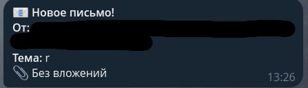

## MailNotify Service
MailNotify Service — это легковесный сервис на Spring Boot для мониторинга почты и получения уведомлений о новых письмах через Telegram-бота

## Требования
- Установленный Docker и Docker Compose
- Созданный Telegram-бот и токен от @BotFather
- Почтовый аккаунт с поддержкой IMAP

## Быстрый старт
### 1. Клонируйте репозиторий
```
git clone https://github.com/dxunvrs/mailnotify-service.git
cd mailnotify-service
```
### 2. Подготовьте нужные переменные
- Создайте бота в Telegram и получите его токен
- Узнайте свой Chat ID, например в @idbotyra_bot
- Получите пароль IMAP в вашем почтовом сервисе

### 3. Создайте ```.env``` файл
В корне проекта создайте ```.env``` файл и заполните его, как в ```env.example``` со своими значениями
```
IMAP_HOST=imap.gmail.com - имя вашего почтового сервиса
IMAP_USER=test_user - имя пользователя 
IMAP_KEY=open-key - пароль IMAP
BOT_TOKEN=token - токен ТГ-бота
CHAT_ID=123 - ваш Chat ID
```

### 4. Запуск в Docker
Запустите проект
```
docker compose up -d --build
```

## Пример работы 


## Технологический стек
- Java 21
- Spring Boot 3
- Spring Integration (Mail), Spring Messaging
- Redis
- Docker & Docker Compose 